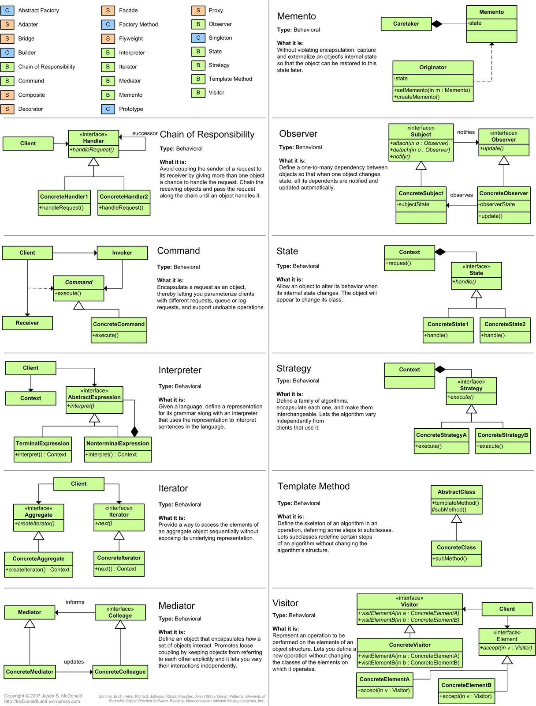

<!-- TOC -->
* [Cross-discipline questions](#cross-discipline-questions)
  * [Design patterns Cheatsheet](#design-patterns-cheatsheet)
    * [Behavioral Cheatsheet, green](#behavioral-cheatsheet-green)
    * [Structural orange and Creational blue Cheatsheet](#structural-orange-and-creational-blue-cheatsheet)
  * [Creational Design Patterns](#creational-design-patterns)
    * [Factory Method](#factory-method)
    * [Abstract Factory](#abstract-factory)
    * [Builder](#builder)
    * [Prototype](#prototype)
    * [Singleton](#singleton)
  * [Structural Design Patterns](#structural-design-patterns)
    * [Adapter](#adapter)
    * [Bridge](#bridge)
    * [Composite](#composite)
    * [Decorator](#decorator)
    * [Facade](#facade)
    * [Flyweight](#flyweight)
    * [Proxy](#proxy)
  * [Behavioral Design Patterns](#behavioral-design-patterns)
    * [Chain of Responsibility](#chain-of-responsibility)
    * [Command](#command)
    * [Iterator](#iterator)
    * [Mediator](#mediator)
    * [Memento](#memento)
    * [Observer](#observer)
      * [State](#state)
    * [Strategy](#strategy)
    * [Template Method](#template-method)
    * [Visitor](#visitor)
  * [CAP](#cap)
    * [Availability](#availability)
    * [Consistency](#consistency)
    * [Partition tolerance](#partition-tolerance)
  * [The CAP theorem](#the-cap-theorem)
  * [Code quality metrics](#code-quality-metrics)
    * [Qualitative Code Quality Metrics](#qualitative-code-quality-metrics)
    * [Quantitative Code Quality Metrics](#quantitative-code-quality-metrics)
  * [Multiprocessing vs Multithreading vs asyncio](#multiprocessing-vs-multithreading-vs-asyncio)
  * [Mmap](#mmap)
  * [ORM - activerecord](#orm---activerecord)
  * [Django middleware](#django-middleware)
  * [Testing, mocks, runner](#testing-mocks-runner)
  * [Test coverage: branch coverage](#test-coverage--branch-coverage)
  * [Test types: performance, penetration, functional, smoke, е2е.](#test-types--performance-penetration-functional-smoke-е2е)
  * [Semantic versioning](#semantic-versioning)
  * [API Richardson Maturity Model](#api-richardson-maturity-model)
  * [Api version](#api-version)
  * [Blue-Green deployment](#blue-green-deployment)
  * [What sort algorithms do you know? At least couple with their tradeoffs](#what-sort-algorithms-do-you-know-at-least-couple-with-their-tradeoffs)
  * [What algorithm is used in Python built-in sort function?](#what-algorithm-is-used-in-python-built-in-sort-function)
  * [If you created 5 forks of the same 10 mb memory process, how much memory would it require?](#if-you-created-5-forks-of-the-same-10-mb-memory-process-how-much-memory-would-it-require)
  * [How does dict work and explain the data structure?](#how-does-dict-work-and-explain-the-data-structure)
  * [Hash tables](#hash-tables)
  * [Ideas on cutting memory consumption of python code](#ideas-on-cutting-memory-consumption-of-python-code)
  * [Difference between docker and VMs](#difference-between-docker-and-vms)
  * [Extreme programming](#extreme-programming)
<!-- TOC -->

# Cross-discipline questions

## Design patterns Cheatsheet

Source: http://www.celinio.net/techblog/?p=65

### Behavioral Cheatsheet, green



### Structural orange and Creational blue Cheatsheet


## Creational Design Patterns

### Factory Method
Common interface.

Provides an interface for creating objects in a superclass, but allows subclasses to alter the type of objects that will
be created.

### Abstract Factory
Furniture -> Antique, Modern.

Lets you produce families of related objects without specifying their concrete classes.

### Builder
Pizza making actions.

Lets you construct complex objects step by step. The pattern allows you to produce different types and representations
of an object using the same construction code.

### Prototype
Copy and Deepcopy.

Lets you copy existing objects without making your code dependent on their classes.

### Singleton
DB connection.

Lets you ensure that a class has only one instance, while providing a global access point to this instance.

## Structural Design Patterns

Structural design patterns explain how to assemble objects and classes into larger structures, while keeping these
structures flexible and efficient.

### Adapter
XML -> JSON.

Allows objects with incompatible interfaces to collaborate.

### Bridge
Different shapes can have different colors.

Lets you split a large class or a set of closely related classes into two separate hierarchies—abstraction and
implementation—which can be developed independently of each other.

### Composite
Tree Structure (Folder/Element).

Lets you compose objects into tree structures and then work with these structures as if they were individual objects.

### Decorator
Additional features for object.

Lets you attach new behaviors to objects by placing these objects inside special wrapper objects that contain the
behaviors.

### Facade
Simple interface for video converter.

Provides a simplified interface to a library, a framework, or any other complex set of classes.

### Flyweight
Bullet in games = Particle + Current Position

Lets you fit more objects into the available amount of RAM by sharing common parts of state between multiple objects
instead of keeping all of the data in each object.

### Proxy
Do not invoke heavy object while you can.

Lets you provide a substitute or placeholder for another object. A proxy controls access to the original object,
allowing you to perform something either before or after the request gets through to the original object.

## Behavioral Design Patterns

Behavioral design patterns are concerned with algorithms and the assignment of responsibilities between objects.

### Chain of Responsibility
Support Levels.

Lets you pass requests along a chain of handlers. Upon receiving a request, each handler decides either to process the
request or to pass it to the next handler in the chain.

### Command
Save command in various place of interface.

Turns a request into a stand-alone object that contains all information about the request. This transformation lets you
pass requests as a method arguments, delay or queue a request's execution, and support undoable operations.

### Iterator
(iter, next)

Lets you traverse elements of a collection without exposing its underlying representation (list, stack, tree, etc.).

### Mediator
Aeroport dispatcher.

Lets you reduce chaotic dependencies between objects. The pattern restricts direct communications between the objects
and forces them to collaborate only via a mediator object.

### Memento
Undo operation (Ctrl+Z).

Lets you save and restore the previous state of an object without revealing the details of its implementation.

### Observer
Publisher and Subscriber.

Lets you define a subscription mechanism to notify multiple objects about any events that happen to the object they're
observing.

#### State
Draft -> Published.

Lets an object alter its behavior when its internal state changes. It appears as if the object changed its class.

Finite-state machine

### Strategy
Navigator -> Drive or Walk

Lets you define a family of algorithms, put each of them into a separate class, and make their objects interchangeable.

### Template Method

Defines the skeleton of an algorithm in the superclass but lets subclasses override specific steps of the algorithm
without changing its structure.

### Visitor
Looks like Mixin

Lets you separate algorithms from the objects on which they operate.

## CAP

CAP theorem, also known as Brewer’s theorem, stands for Consistency, Availability and Partition Tolerance. But let’s try
to understand each, with an example.

### Availability

Imagine there is a very popular mobile operator in your city and you are its customer because of the amazing plans it
offers. Besides that, they also provide an incredible customer care service where you can call anytime and get your 
queries
and concerns answered quickly and efficiently. Whenever a customer calls them, the mobile operator is able to connect
them to one of their customer care operators.

The customer is able to elicit any information required by her/him about his accounts like balance, usage, or other
information. We call this Availability because every customer is able to connect to the operator and get the information
about the user/customer.

Availability means that every request from the user should elicit a response from the system. Whether the user wants to
read or write, the user should get a response even if the operation was unsuccessful. This way, every operation is bound
to terminate.

For example, when you visit your bank’s ATM, you are able to access your account and its related information. Now even
if you go to some other ATM, you should still be able to access your account. If you are only able to access your
account from one ATM and not another, this means that the information is not available with all the ATMs.

Availability is of importance when it is required that the client or user be able to access the data at all times, even
if it is not consistent. For example, you should be able to see your friend’s Whatsapp status even if you are viewing an
outdated one due to some network failure.

### Consistency

Now, you have recently shifted to a new house in the city and you want to update your address registered with the mobile
operator. You decide to call the customer care operator and update it with them. When you call, you connect with an
operator. This operator makes the relevant changes in the system. But once you have put down the phone, you realize you
told them the correct street name but the old house number (old habits die hard!).

So you frantically call the customer care again. This time when you call, you connect with a different customer care
operator, but they are able to access your records as well and know that you have recently updated your address. They
make the relevant changes in the house number and the rest of the address is the same as the one you told the last
operator.

We call this as Consistency because even though you connect to a different customer care operator, they were able to
retrieve the same information.

Consistency means that the user should be able to see the same data no matter which node they connect to on the system.
This data is the most recent data written to the system. So if a write operation has occurred on a node, it should be
replicated to all its replicas. So that whenever a user connects to the system, they can see that same information.

However, having a system that maintains consistency instantaneously and globally is near impossible. Therefore, the goal
is to make this transition fast enough so that it is hardly noticeable.

Consistency is of importance when it is required that all the clients or users view the same data. This is important in
places that deal with financial or personal information. For example, your bank account should reflect the same balance
whether you view it from your PC, tablet, or smartphone!

### Partition tolerance

Recently you have noticed that your current mobile plan does not suit you. You do not access that much mobile data any
longer because you have good wi-fi facilities at home and at the office, and you hardly step outside anywhere.
Therefore, you want to update your mobile plan. So you decide to call the customer care once again.

On connecting with the operator this time, they tell you that they have not been able to update their records due to
some issues. So the information lying with the operator might not be up to date, therefore they cannot update the
information. We can say here that the service is broken or there is no Partition tolerance.

Partition refers to a communication break between nodes within a distributed system. Meaning, if a node cannot receive
any messages from another node in the system, there is a partition between the two nodes. Partition could have been
because of network failure, server crash, or any other reason.

So, if Partition means a break in communication then Partition tolerance would mean that the system should still be able
to work even if there is a partition in the system. Meaning if a node fails to communicate, then one of the replicas of
the node should be able to retrieve the data required by the user.

This is handled by keeping replicas of the records in multiple different nodes. So that even if a partition occurs, we
are able to retrieve the data from its replica. As you must have guessed already, partition tolerance is a must for any
distributed database system.

## The CAP theorem

`The CAP theorem` states that a distributed database system has to make a tradeoff between Consistency and Availability
when a Partition occurs.

`CassandraDB` - AP (no consistency)

`MongoDB` - CP (loosing availability)

https://www.analyticsvidhya.com/blog/2020/08/a-beginners-guide-to-cap-theorem-for-data-engineering/

## Code quality metrics

### Qualitative Code Quality Metrics

Qualitative metrics are subjective measurements that aim to better define what good means.

`Extensibility`
Extensibility is the degree to which software is coded to incorporate future growth. The central theme of extensible
applications is that developers should be able to add new features to code or change existing functionality without it
affecting the entire system.

`Maintainability`
Code maintainability is a qualitative measurement of how easy it is to make changes, and the risks associated with such
changes.

Developers can make judgments about maintainability when they make changes — if the change should take an hour but it
ends up taking three days, the code probably isn’t that maintainable.

Another way to gauge maintainability is to check the number of lines of code in a given software feature or in an entire
application. Software with more lines can be harder to maintain.

`Readability and Code Formatting`
Readable code should use indentation and be formatted according to standards particular to the language it’s written in;
this makes the application structure consistent and visible.

`Testing`: The Next Bottleneck in Continuous Delivery | Download >>

`Comments should be used where required`, with concise explanations given for each method. Names for methods should be
meaningful in the sense that the names indicate what the method does.

`Clarity`
Clarity is an indicator of quality that says good code should be unambiguous. If you look at a piece of code and wonder
what on earth it does, then that code is ambiguous.

This, along with readability and documentation, means any other developer can easily use code written by someone else,
without taking a long time to understand how it works.

`Well-documented`
If the program is not documented, it will be difficult for other developers to use it, or even for the same developer to
understand the code years from now. One common definition of quality is that it may be “used long term, can be carried
across to future releases and products” (without being considered “legacy code”). Documentation is essential to make
this happen.

Documentation also provides a way to improve by formalizing the decisions you make when writing. When you document code
and do it well, you need to think differently about each component and why it exists in the software. Writing out the
reasons for certain programming decisions can improve application design.

`Well-tested`
Well tested programs are likely to be of higher quality, because much more attention is paid to the inner workings of
the code and its impact on users. Testing means that the application is constantly under scrutiny.

`Efficiency`
Efficient code only uses the computing resources it needs to. Another efficiency measurement is that it runs in as
little time as possible.

Many developers believe that inefficient code is not of good quality (even if it satisfies some of the criteria above).
Some negative impacts of not building for efficiency is long build times, difficulty to detect and fix bugs, and
performance issues for the user.

### Quantitative Code Quality Metrics

There are a few quantitative measurements to reveal well written applications:

`Weighted Micro Function Points`
This metric is a modern software sizing algorithm that parses source code and breaks it down into micro functions. The
algorithm then produces several complexity metrics from these micro functions, before interpolating the results into a
single score.

WMFP automatically measures the complexity of existing source code. The metrics used to determine the WMFP value include
comments, code structure, arithmetic calculations, and flow control path.

`Halstead Complexity Measures`
The Halstead complexity measures were introduced in 1977. These measures include program vocabulary, program length,
volume, difficulty, effort, and the estimated number of bugs in a module. The aim of the measurement is to assess the
computational complexity of a program. The more complex any code is, the harder it is to maintain and the lower its
quality.

`Cyclomatic Complexity`
Cyclomatic complexity is a metric that measures the structural complexity of a program. It does so by counting the
number of linearly independent paths through a program’s source code. Methods with high cyclomatic complexity (greater
than 10) are more likely to contain defects.

With cyclomatic complexity, developers get an indicator of how difficult it will be to test, maintain, and troubleshoot
their programming. This metric can be combined with a size metric such as lines of code, to predict how easy the
application will be to modify and maintain.

## Multiprocessing vs Multithreading vs asyncio

CPU Bound => Multi Processing

I/O Bound, Fast I/O, Limited Number of Connections => Multi Threading

I/O Bound, Slow I/O, Many connections => Asyncio

4. Event loop – how it works. Виды многозадачности
5. SQL vs noSQL databases

## Mmap

In computing, mmap(2) is a POSIX-compliant Unix system call that maps files or devices into memory. It is a method of
memory-mapped file I/O. It implements demand paging because file contents are not read from disk directly and initially
do not use physical RAM at all. The actual reads from disk are performed in a "lazy" manner, after a specific location
is accessed. After the memory is no longer needed, it is important to munmap(2) the pointers to it. Protection
information can be managed using mprotect(2), and special treatment can be enforced using madvise(2).

In Linux, macOS and the BSDs, mmap can create several types of mappings. Other operating systems may only support a
subset of these; for example, shared mappings may not be practical in an operating system without a global VFS or I/O
cache.

## ORM - activerecord

1 What is Active Record?
Active Record is the M in MVC - the model - which is the layer of the system responsible for representing business data
and logic. Active Record facilitates the creation and use of business objects whose data requires persistent storage to
a database. It is an implementation of the Active Record pattern which itself is a description of an Object Relational
Mapping system.

1.1 The Active Record Pattern
Active Record was described by Martin Fowler in his book Patterns of Enterprise Application Architecture. In Active
Record, objects carry both persistent data and behavior which operates on that data. Active Record takes the opinion
that ensuring data access logic as part of the object will educate users of that object on how to write to and read from
the database.

1.2 Object Relational Mapping
Object Relational Mapping, commonly referred to as its abbreviation ORM, is a technique that connects the rich objects
of an application to tables in a relational database management system. Using ORM, the properties and relationships of
the objects in an application can be easily stored and retrieved from a database without writing SQL statements directly
and with less overall database access code.

1.3 Active Record as an ORM Framework
Active Record gives us several mechanisms, the most important being the ability to:

- Represent models and their data.
- Represent associations between these models.
- Represent inheritance hierarchies through related models.
- Validate models before they get persisted to the database.
- Perform database operations in an object-oriented fashion.

2 Convention over Configuration in Active Record

2.1 Naming Conventions

Model Class - Singular with the first letter of each word capitalized (e.g., BookClub).
Database Table - Plural with underscores separating words (e.g., book_clubs).

2.2 Schema Conventions

- Foreign keys - These fields should be named following the pattern singularized_table_name_id (e.g., item_id, order_id)
  . These are the fields that Active Record will look for when you create associations between your models.
- Primary keys - By default, Active Record will use an integer column named id as the table's primary key (bigint for
  PostgreSQL and MySQL, integer for SQLite). When using Active Record Migrations to create your tables, this column will
  be automatically created.

## Django middleware

Middleware is a framework of hooks into Django’s request/response processing. It’s a light, low-level “plugin” system
for globally altering Django’s input or output.

Each middleware component is responsible for doing some specific function. For example, Django includes a middleware
component, AuthenticationMiddleware, that associates users with requests using sessions.

```python
def simple_middleware(get_response):
    # One-time configuration and initialization.

    def middleware(request):
        # Code to be executed for each request before
        # the view (and later middleware) are called.

        response = get_response(request)

        # Code to be executed for each request/response after
        # the view is called.

        return response

    return middleware
```

## Testing, mocks, runner

- Manual Testing
- Unit Tests (A unit test is a smaller test, one that checks that a single component operates in the right way. A unit
  test helps you to isolate what is broken in your application and fix it faster.)
- Integration Tests (Testing multiple components is known as integration testing.)
  - Calling an HTTP REST API
  - Calling a Python API
  - Calling a web service
  - Running a command line

Runners:

- `unittest`;
- `nose` или nose2; (You may find that over time, as you write hundreds or even thousands of tests for your application,
  it becomes increasingly hard to understand and use the output from unittest. `nose` is compatible with any tests
  written using the unittest framework and can be used as a drop-in replacement for the unittest test runner. The
  development of nose as an open-source application fell behind, and a fork called nose2 was created. If you’re starting
  from scratch, it is recommended that you use nose2 instead of nose.)
- `pytest`

## Test coverage: branch coverage

Branch coverage is a metric that indicates whether all branches in a codebase are exercised by tests. A “branch” is one
of the possible execution paths the code can take after a decision statement—e.g., an if statement—gets evaluated.

Branch coverage is an important metric in that it can help a team or organization assess whether an application has been
tested to completion. A low branch coverage shows that there are scenarios in the application lacking testing. Such
scenarios might contain defects that will only manifest in edge cases when the application makes it to production.

## Test types: performance, penetration, functional, smoke, е2е.

`performance` - https://locust.io/ Define user behaviour with Python code, and swarm your system with millions of
simultaneous users.

`Penetration testing` (Pen testing) is an attempt to evaluate the security of an IT infrastructure by simulating a
cyber-attack against computer system to exploit vulnerabilities. It helps an organization strengthen its defenses
against cyber-attacks by identifying vulnerabilities.

`functional` - A functional test is a form of integration test in which the application is run "literally". You would
have to make sure that an email was actually sent in a functional test, because it tests your code end to end.

`Sanity` testing is a kind of Software Testing performed after receiving a software build, with minor changes in code,
or functionality, to ascertain that the bugs have been fixed and no further issues are introduced due to these changes.
The goal is to determine that the proposed functionality works roughly as expected. If sanity test fails, the build is
rejected to save the time and costs involved in a more rigorous testing.

`Smoke Testing` is a software testing process that determines whether the deployed software build is stable or not.
Smoke testing is a confirmation for QA team to proceed with further software testing. It consists of a minimal set of
tests run on each build to test software functionalities. Smoke testing is also known as “Build Verification Testing” or
“Confidence Testing.”

`End-to-end` testing frameworks are a powerful way to ensure that all moving parts within an application are configured
correctly, and that the application's is functionally working correctly. `selenium` for python

## Semantic versioning

Given a version number MAJOR.MINOR.PATCH, increment the:

- MAJOR version when you make incompatible API changes,
- MINOR version when you add functionality in a backwards compatible manner, and
- PATCH version when you make backwards compatible bug fixes.

Additional labels for pre-release and build metadata are available as extensions to the MAJOR.MINOR.PATCH format.

## API Richardson Maturity Model

- Level 1 tackles the question of handling complexity by using divide and conquer, breaking a large service endpoint
  down into multiple `resources`
- Level 2 introduces a `standard set of verbs` so that we handle similar situations in the same way, removing
  unnecessary variation
- Level 3 introduces discoverability, providing a way of `making a protocol more self-documenting`

## Api version

- URI Path `http://www.example.com/api/v1/products`
- Query Params `http://www.example.com/api/products?version=1`
- Header `Accept: version=1.0`

## Blue-Green deployment

Blue-green deployment is an application release model that gradually transfers user traffic from a previous version of
an app or microservice to a nearly identical new release—both of which are running in production.

The old version can be called the blue environment while the new version can be known as the green environment. Once
production traffic is fully transferred from blue to green, blue can standby in case of rollback or pulled from
production and updated to become the template upon which the next update is made.

There are downsides to this continuous deployment model. Not all environments have the same uptime requirements or the
resources to properly perform CI/CD processes like blue green. But many apps evolve to support such continuous delivery
as the enterprises supporting them digitally transform.

## What sort algorithms do you know? At least couple with their tradeoffs

- Quicksort n\log n (worst n2), memory logN => Not stable
- Merge sort n\log n (memory N) => Stable
- Bubble sort N2
- Heapsort nlogn and memory 1 => not stable

## What algorithm is used in Python built-in sort function?

Python uses an algorithm called `Timsort`:

Timsort is a hybrid sorting algorithm, derived from merge sort and insertion sort, designed to perform well on many
kinds of real-world data. It was invented by Tim Peters in 2002 for use in the Python programming language. The
algorithm finds subsets of the data that are already ordered, and uses the subsets to sort the data more efficiently.
This is done by merging an identified subset, called a run, with existing runs until certain criteria are fulfilled.
Timsort has been Python's standard sorting algorithm since version 2.3. It is now also used to sort arrays in Java SE 7,
and on the Android platform.

## If you created 5 forks of the same 10 mb memory process, how much memory would it require?

A bit more than 10:

The child process has an exact copy of all the memory segments of the parent process. In modern UNIX variants that
follow the virtual memory model from SunOS-4.0, copy-on-write semantics are implemented and the physical memory need not
be actually copied. Instead, virtual memory pages in both processes may refer to the same pages of physical memory until
one of them writes to such a page: then it is copied. This optimization is important in the common case where fork is
used in conjunction with exec to execute a new program: typically, the child process performs only a small set of
actions before it ceases execution of its program in favour of the program to be started, and it requires very few, if
any, of its parent's data structures.

## How does dict work and explain the data structure?

Python dictionaries are implemented as hash tables.

Hash tables must allow for hash collisions i.e. even if two distinct keys have the same hash value, the table's
implementation must have a strategy to insert and retrieve the key and value pairs unambiguously.

Python dict uses open addressing to resolve hash collisions (explained below) (see dictobject.c:296-297).

Python hash table is just a contiguous block of memory (sort of like an array, so you can do an O(1) lookup by index).

Each slot in the table can store one and only one entry. This is important.

Each entry in the table is actually a combination of the three values: < hash, key, value >. This is implemented as a C
struct (see dictobject.h:51-56).

The figure below is a logical representation of a Python hash table. In the figure below, 0, 1, ..., i, ... on the left
are indices of the slots in the hash table (they are just for illustrative purposes and are not stored along with the
table obviously!).

Logical model of Python Hash table
```sh
-+-----------------+
0| <hash|key|value>|
-+-----------------+
1|      ...        |
-+-----------------+
.|      ...        |
-+-----------------+
i|      ...        |
-+-----------------+
.|      ...        |
-+-----------------+
n|      ...        |
-+-----------------+
```

When a new dict is initialized it starts with 8 slots. (see dictobject.h:49)

When adding entries to the table, we start with some slot, i, that is based on the hash of the key. CPython initially
uses i = hash(key) & mask (where mask = PyDictMINSIZE - 1, but that's not really important). Just note that the initial
slot, i, that is checked depends on the hash of the key.

If that slot is empty, the entry is added to the slot (by entry, I mean, <hash|key|value>). But what if that slot is
occupied!? Most likely because another entry has the same hash (hash collision!)

If the slot is occupied, CPython (and even PyPy) compares the hash AND the key (by compare I mean == comparison not the
is comparison) of the entry in the slot against the hash and key of the current entry to be inserted (dictobject.c:
337,344-345) respectively. If both match, then it thinks the entry already exists, gives up and moves on to the next
entry to be inserted. If either hash or the key don't match, it starts probing.

Probing just means it searches the slots by slot to find an empty slot. Technically we could just go one by one, i+1,
i+2, ... and use the first available one (that's linear probing). But for reasons explained beautifully in the
comments (see dictobject.c:33-126), CPython uses random probing. In random probing, the next slot is picked in a pseudo
random order. The entry is added to the first empty slot. For this discussion, the actual algorithm used to pick the
next slot is not really important (see dictobject.c:33-126 for the algorithm for probing). What is important is that the
slots are probed until first empty slot is found.

The same thing happens for lookups, just starts with the initial slot i (where i depends on the hash of the key). If the
hash and the key both don't match the entry in the slot, it starts probing, until it finds a slot with a match. If all
slots are exhausted, it reports a fail.

BTW, the dict will be resized if it is two-thirds full. This avoids slowing down lookups. (see dictobject.h:64-65)

https://stackoverflow.com/questions/327311/how-are-pythons-built-in-dictionaries-implemented

## Hash tables

Hash tables are used to quickly store and retrieve data (or records).
Records are stored in buckets using hash keys.
Hash keys are calculated by applying a hashing algorithm to a chosen value (the key value) contained within the record.
This chosen value must be a common value to all the records.
Each bucket can have multiple records which are organized in a particular order.
Real World Example:

Hash & Co., founded in 1803 and lacking any computer technology had a total of 300 filing cabinets to keep the detailed
information (the records) for their approximately 30,000 clients. Each file folder were clearly identified with its
client number, a unique number from 0 to 29,999.

The filing clerks of that time had to quickly fetch and store client records for the working staff. The staff had
decided that it would be more efficient to use a hashing methodology to store and retrieve their records.

To file a client record, filing clerks would use the unique client number written on the folder. Using this client
number, they would modulate the hash key by 300 in order to identify the filing cabinet it is contained in. When they
opened the filing cabinet they would discover that it contained many folders ordered by client number. After identifying
the correct location, they would simply slip it in.

To retrieve a client record, filing clerks would be given a client number on a slip of paper. Using this unique client
number (the hash key), they would modulate it by 300 in order to determine which filing cabinet had the clients folder.
When they opened the filing cabinet they would discover that it contained many folders ordered by client number.
Searching through the records they would quickly find the client folder and retrieve it.

In our real-world example, our buckets are filing cabinets and our records are file folders.

## Ideas on cutting memory consumption of python code

Use dicts, sets, generators

## Difference between docker and VMs

Docker originally used LinuX Containers (LXC), but later switched to runC (formerly known as libcontainer), which runs
in the same operating system as its host. This allows it to share a lot of the host operating system resources. Also, it
uses a layered filesystem (AuFS) and manages networking.

AuFS is a layered file system, so you can have a read only part and a write part which are merged together. One could
have the common parts of the operating system as read only (and shared amongst all of your containers) and then give
each container its own mount for writing.

So, let's say you have a 1 GB container image; if you wanted to use a full VM, you would need to have 1 GB x number of
VMs you want. With Docker and AuFS you can share the bulk of the 1 GB between all the containers and if you have 1000
containers you still might only have a little over 1 GB of space for the containers OS (assuming they are all running
the same OS image).

A full virtualized system gets its own set of resources allocated to it, and does minimal sharing. You get more
isolation, but it is much heavier (requires more resources). With Docker you get less isolation, but the containers are
lightweight (require fewer resources). So you could easily run thousands of containers on a host, and it won't even
blink. Try doing that with Xen, and unless you have a really big host, I don't think it is possible.

A full virtualized system usually takes minutes to start, whereas Docker/LXC/runC containers take seconds, and often
even less than a second.

There are pros and cons for each type of virtualized system. If you want full isolation with guaranteed resources, a
full VM is the way to go. If you just want to isolate processes from each other and want to run a ton of them on a
reasonably sized host, then Docker/LXC/runC seems to be the way to go.

## Extreme programming

Extreme Programming (XP) is an agile software development framework that aims to produce higher quality software, and
higher quality of life for the development team. XP is the most specific of the agile frameworks regarding appropriate
engineering practices for software development.

The five values of XP are communication, simplicity, feedback, courage, and respectю

- The Planning Game
- Small Releases
- Metaphor
- Simple Design
- Testing
- Refactoring
- Pair Programming
- Collective Ownership
- Continuous Integration
- 40-hour week
- On-site Customer
- Coding Standard
